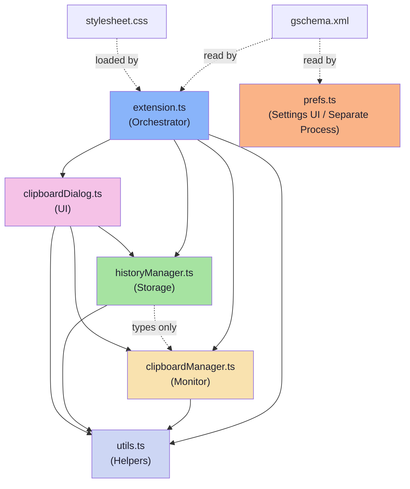

# WinClip — Codebase Metadata

> **Purpose**: Quick reference so contributors know exactly what each file does, which features live where, and what's safe to modify — without reading the full codebase.

---

## Architecture Overview

```
┌─────────────────────────────────────────────────────────────┐
│                    extension.ts  (ORCHESTRATOR)             │
│  - enable()/disable() lifecycle                             │
│  - wires all managers + dialog together                     │
│  - registers Super+V keybinding                             │
├──────────┬──────────────┬──────────────┬────────────────────┤
│          │              │              │                    │
│  clipboardManager.ts  historyManager.ts  clipboardDialog.ts │
│  (MONITOR)           (STORAGE)         (UI)                │
│          │              │              │                    │
│          └──────────────┼──────────────┘                    │
│                         │                                  │
│                    utils.ts  (SHARED HELPERS)               │
└─────────────────────────────────────────────────────────────┘

Separate process (GTK4):
  prefs.ts  (PREFERENCES UI — runs outside gnome-shell)
```

---

## Source Files (`src/`)

### `extension.ts` — Main Entry Point (ORCHESTRATOR)

| | |
|---|---|
| **Role** | GNOME Shell extension lifecycle — `enable()` and `disable()` |
| **Features** | Super+V keybinding registration, manager initialization, dialog chrome management, settings change listener |
| **Depends on** | `clipboardManager.ts`, `historyManager.ts`, `clipboardDialog.ts`, `utils.ts` |
| **Depended by** | Nothing (top-level entry point) |
| **Key APIs** | `Extension` base class, `Main.wm.addKeybinding()`, `Main.layoutManager.addTopChrome()` |
| **Safe to modify** | ✅ Yes — add new managers/features here, change shortcut behavior |
| **Caution** | Must properly clean up ALL resources in `disable()` or extension will leak. Every signal, timeout, and widget you add in `enable()` must be undone in `disable()`. |

---

### `clipboardManager.ts` — Clipboard Monitor (MONITOR)

| | |
|---|---|
| **Role** | Watches system clipboard for changes, reads content, writes content back |
| **Features** | Detect TEXT / IMAGE / FILE clipboard changes, deduplication, write text/image/file back to clipboard |
| **Depends on** | `utils.ts` (`debug`) |
| **Depended by** | `extension.ts`, `clipboardDialog.ts` |
| **Key APIs** | `Meta.Selection` (`owner-changed` signal), `St.Clipboard` (`get_text`, `get_content`, `set_text`, `set_content`) |
| **Exports** | `ContentType` enum, `ClipboardEntry` interface, `ClipboardManager` class |
| **Safe to modify** | ✅ Yes — add new MIME types, content types, or detection logic |
| **Caution** | MIME type detection order matters! File (`x-special/gnome-copied-files`) → Image (`image/png`) → Text (`text/plain`). Changing order will break content type detection. |

**Content Types:**
| Type | Value | MIME Types | Description |
|------|-------|------------|-------------|
| `TEXT` | 0 | `text/plain`, `text/plain;charset=utf-8`, `UTF8_STRING` | Plain text |
| `IMAGE` | 1 | `image/png` | Screenshot or image data |
| `FILE` | 2 | `x-special/gnome-copied-files` | File copied from Nautilus/file manager |

**Key Methods:**
| Method | Purpose |
|--------|---------|
| `startTracking()` | Start listening for clipboard changes |
| `stopTracking()` | Stop listening |
| `onChanged(callback)` | Register a change listener |
| `setTextContent(text)` | Write text to clipboard |
| `setImageContent(bytes)` | Write PNG bytes to clipboard |
| `setFileContent(content)` | Write `x-special/gnome-copied-files` back to clipboard |

---

### `historyManager.ts` — Persistent Storage (STORAGE)

| | |
|---|---|
| **Role** | Stores clipboard history to disk, surviving restarts |
| **Features** | Add/remove/pin entries, session persistence (JSON + image files), deduplication, eviction of old entries, search |
| **Depends on** | `clipboardManager.ts` (types only: `ContentType`, `ClipboardEntry`), `utils.ts` |
| **Depended by** | `extension.ts`, `clipboardDialog.ts` |
| **Key APIs** | `Gio.File` for disk I/O |
| **Exports** | `HistoryEntry` interface, `HistoryManager` class |
| **Safe to modify** | ✅ Yes — safe to add new fields to `HistoryEntry`, add new storage methods |
| **Caution** | Changing the `HistoryEntry` shape requires migration of existing `history.json` files — existing users will get corrupted history if fields are renamed/removed without migration logic. |

**Storage Locations:**
| Path | Content |
|------|---------|
| `~/.local/share/winclip/history.json` | Serialized `HistoryEntry[]` array |
| `~/.local/share/winclip/images/` | Saved PNG files for IMAGE entries |

**HistoryEntry Shape:**
```typescript
interface HistoryEntry {
  id: string;           // unique ID (timestamp + random)
  type: ContentTypeValue; // 0=TEXT, 1=IMAGE, 2=FILE
  text?: string;        // text content (TEXT), or raw gnome-copied-files content (FILE)
  imagePath?: string;   // path to saved PNG (IMAGE only)
  pinned: boolean;      // pinned items are exempt from eviction
  timestamp: number;    // Date.now() when captured
}
```

---

### `clipboardDialog.ts` — Floating Dialog UI (UI)

| | |
|---|---|
| **Role** | The floating clipboard history panel activated by Super+V |
| **Features** | Search/filter, item display (text/image/file), image thumbnails, pin/delete actions, click-to-paste, keyboard navigation (↑↓/Enter/Escape/Delete), click-outside-to-close, close button |
| **Depends on** | `clipboardManager.ts` (types + `setTextContent`/`setImageContent`/`setFileContent`), `historyManager.ts` (types + `getEntries`/`getImageBytes`/etc.), `utils.ts` |
| **Depended by** | `extension.ts` |
| **Key APIs** | `St.BoxLayout`, `St.Entry`, `St.ScrollView`, `St.Button`, `St.Icon`, `St.Label`, `Clutter` events, `Gio.Subprocess` (xdotool) |
| **Safe to modify** | ✅ Yes — this is the primary UI file, most visual changes go here |
| **Caution** | Key event handler is on `global.stage` (not the container) — chrome actors don't bubble key events reliably. Click-outside uses `captured-event` on `global.stage`. Don't move these back to the container. |

**Constants:**
| Name | Value | Purpose |
|------|-------|---------|
| `DIALOG_WIDTH` | 420 | Dialog width in pixels |
| `DIALOG_HEIGHT` | 520 | Dialog height in pixels |
| `ITEM_MAX_TEXT_LEN` | 80 | Max visible text chars per item |
| `THUMBNAIL_SIZE` | 64 | Image thumbnail size |
| `IMAGE_EXTENSIONS` | `.png`, `.jpg`, etc. | File extensions treated as images |

**Paste Mechanism:**
1. Write content to clipboard via `ClipboardManager`
2. Hide dialog (returns focus to previous window)
3. After 150ms delay, run `xdotool key ctrl+v` via `Gio.Subprocess`

> **For image files copied from Nautilus**: loads actual image bytes from disk and pastes as `image/png` (not `x-special/gnome-copied-files`), so target apps receive real image data.

---

### `prefs.ts` — Preferences Page (SETTINGS UI)

| | |
|---|---|
| **Role** | GTK4/Adw preferences window — runs in a **separate process**, NOT inside gnome-shell |
| **Features** | Max history items spinner (10–200), keyboard shortcut display, about info |
| **Depends on** | Nothing (standalone) |
| **Depended by** | Nothing (loaded by GNOME Extensions app) |
| **Key APIs** | `ExtensionPreferences` base class, `Adw.PreferencesPage`, `Adw.SpinRow`, `Gio.SettingsBindFlags` |
| **Safe to modify** | ✅ Yes — add new preference rows freely |
| **Caution** | Cannot import any `St` or `Shell` or `Meta` modules — those only exist inside gnome-shell, not in the prefs GTK process. Uses `gi://Gtk?version=4.0` and `gi://Adw`. New GSettings keys need matching entries in `gschema.xml`. |

---

### `utils.ts` — Shared Utilities (HELPERS)

| | |
|---|---|
| **Role** | Pure utility functions shared across all modules |
| **Features** | Data directory paths, directory creation, ID generation, text truncation, debug logging |
| **Depends on** | Nothing (leaf module) |
| **Depended by** | `clipboardManager.ts`, `historyManager.ts`, `clipboardDialog.ts`, `extension.ts` |
| **Safe to modify** | ✅ Yes — add new helpers freely |
| **Caution** | Changing `getDataDir()` / `getImagesDir()` / `getHistoryFilePath()` will break access to existing user data. |

---

## Config & Build Files (Project Root)

### `metadata.json` — Extension Identity 🔒

| | |
|---|---|
| **Role** | Declares extension UUID, name, GNOME Shell version, GSettings schema |
| **Must not change** | `uuid` (breaks existing installs), `settings-schema` (must match gschema.xml) |
| **Safe to change** | `name`, `description`, `url`, add `shell-version` entries |

### `schemas/org.gnome.shell.extensions.winclip.gschema.xml` — GSettings Schema

| | |
|---|---|
| **Role** | Defines persistent settings (max-history-items, global-shortcut) |
| **Safe to modify** | ✅ Add new `<key>` elements for new preferences |
| **Caution** | Removing/renaming existing keys breaks users who already have saved settings. Must run `glib-compile-schemas` after changes. |

### `stylesheet.css` — St Widget Styles

| | |
|---|---|
| **Role** | CSS for all St widgets inside gnome-shell (dialog, items, buttons, search) |
| **Safe to modify** | ✅ Yes — freely change colors, sizes, animations |
| **Caution** | `spacing` is a valid St property but triggers CSS lint warnings — ignore those. Uses Catppuccin-inspired dark theme. |

**CSS Classes:**
| Class | Widget |
|-------|--------|
| `.winclip-dialog` | Main dialog container |
| `.winclip-header` | Header bar |
| `.winclip-title` | Title label |
| `.winclip-clear-button` | Trash/clear all button |
| `.winclip-close-button` | X close button |
| `.winclip-search` | Search input |
| `.winclip-scroll` | ScrollView |
| `.winclip-list` | List container |
| `.winclip-item` | Clipboard entry row |
| `.winclip-item-pinned` | Pinned entry row (added alongside `.winclip-item`) |
| `.winclip-item-icon` | Text/file icon |
| `.winclip-item-text` | Item label |
| `.winclip-item-image` | Image thumbnail |
| `.winclip-action-button` | Pin/delete buttons |
| `.winclip-empty` | Empty state message |

### `esbuild.js` — Build Configuration

| | |
|---|---|
| **Role** | Bundles TypeScript → ESM JavaScript |
| **Key settings** | `format: "esm"`, `target: "firefox115"`, `external: ["gi://*", "resource://*"]` |
| **Safe to modify** | ✅ Add new entry points if new top-level modules are needed |
| **Caution** | The `external` patterns must include all GNOME runtime modules. Never remove `gi://*` or `resource://*`. |

### `Makefile` — Build & Install Automation

| | |
|---|---|
| **Targets** | `build`, `install`, `clean`, `uninstall` |
| **Safe to modify** | ✅ Add new copy targets if new files need installing |
| **Install location** | `~/.local/share/gnome-shell/extensions/winclip@Shadab909.github.io/` |

### `package.json` / `tsconfig.json`

| | |
|---|---|
| **Deps** | `esbuild` + `typescript` (dev only) |
| **Note** | No `@girs/*` type packages — they're optional for IDE hints, esbuild doesn't need them |

---

## Dependency Graph



---

## Feature → File Map

| Feature | Primary File(s) | Notes |
|---------|-----------------|-------|
| Super+V shortcut | `extension.ts` | Keybinding setup in `enable()` |
| Clipboard monitoring | `clipboardManager.ts` | `Meta.Selection` → `owner-changed` |
| Text copy detection | `clipboardManager.ts` | `St.Clipboard.get_text()` |
| Image copy detection | `clipboardManager.ts` | `St.Clipboard.get_content("image/png")` |
| File copy detection | `clipboardManager.ts` | `St.Clipboard.get_content("x-special/gnome-copied-files")` |
| History persistence | `historyManager.ts` | JSON + image files in `~/.local/share/winclip/` |
| Pinning items | `historyManager.ts` + `clipboardDialog.ts` | Storage logic + UI button |
| Search/filter | `historyManager.ts` + `clipboardDialog.ts` | Filter logic + search entry UI |
| Eviction (max items) | `historyManager.ts` | Removes oldest unpinned entries |
| Dialog UI | `clipboardDialog.ts` | St widgets, layout, interactions |
| Image thumbnails | `clipboardDialog.ts` | `Gio.icon_new_for_string()` for both IMAGE and FILE entries |
| Paste via xdotool | `clipboardDialog.ts` | `Gio.Subprocess` → `xdotool key ctrl+v` |
| Keyboard navigation | `clipboardDialog.ts` | ↑↓ arrows, Enter, Escape, Delete |
| Click-outside-to-close | `clipboardDialog.ts` | `captured-event` on `global.stage` |
| Close button | `clipboardDialog.ts` + `stylesheet.css` | `window-close-symbolic` icon button |
| Preferences page | `prefs.ts` + `gschema.xml` | GTK4/Adw in separate process |
| Max items setting | `prefs.ts` + `gschema.xml` + `extension.ts` | Schema → prefs UI → extension reads |
| Styling/theme | `stylesheet.css` | Catppuccin-inspired dark theme |

---

## ⚠️ Rules of Engagement

### 🔴 DO NOT change without migration strategy
- `HistoryEntry` interface field names/types (users have existing `history.json`)
- `ContentType` enum values (stored in `history.json`)
- Storage paths in `utils.ts` (`getDataDir`, `getImagesDir`, `getHistoryFilePath`)
- `uuid` in `metadata.json`
- `settings-schema` in `metadata.json`
- GSettings key names in `gschema.xml`

### 🟡 Change with care
- MIME detection order in `clipboardManager.ts` (FILE → IMAGE → TEXT)
- Event handlers on `global.stage` in `clipboardDialog.ts` (chrome actor workaround)
- `disable()` in `extension.ts` (must clean up everything added in `enable()`)

### 🟢 Safe to change freely
- Visual styling in `stylesheet.css`
- UI layout/widgets in `clipboardDialog.ts`
- New preference rows in `prefs.ts` (with matching gschema key)
- New helper functions in `utils.ts`
- Dialog dimensions, text truncation length, thumbnail size

---

## Runtime Dependencies

| Dependency | Purpose | Required? |
|------------|---------|-----------|
| GNOME Shell 46 | Extension host | ✅ Yes |
| X11 session | xdotool requires X11 | ✅ Yes |
| `xdotool` | Simulates Ctrl+V paste | ✅ Yes (`sudo apt install xdotool`) |

## Build Dependencies

| Dependency | Purpose |
|------------|---------|
| Node.js ≥ 18 | Run esbuild |
| `esbuild` (npm) | Bundle TypeScript → ESM |
| `typescript` (npm) | Type checking (optional) |
| `glib-compile-schemas` | Compile GSettings schema |
